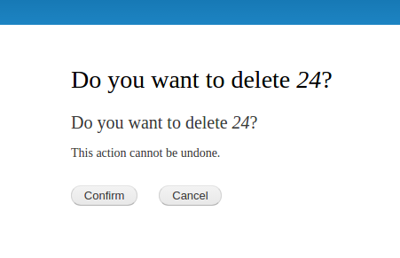

[](https://www.drupal.org/docs/drupal-apis/form-api/confirmformbase-to-confirm-an-action)[https://www.drupal.org/docs/drupal-apis/form-api/confirmformbase-to-confirm-an-action](https://www.drupal.org/docs/drupal-apis/form-api/confirmformbase-to-confirm-an-action)

Формы подтверждения довольно просты в создании и являются рекомендуемым способом подсказки пользователю о подтверждении действия. Как и многие другие формы, все начинается с маршрута.

# Маршруты

В файле `.routing.yml` модуля создайте маршрут к форме. Во многих случаях будет желательно передать параметр из пути в форму подтверждения, как в случае с удалением какого-то содержимого. Это можно увидеть в следующем примере:

```yaml
example_module.delete:
  path: '/example/{id}/delete'
  defaults:
    _form: '\\Drupal\\example_module\\Form\\ConfirmDeleteForm'
    _title: 'Confirm Deletion'
  requirements:
    _permission: 'administer site configuration'
    id: ^\\d+$
```

Значение `id` передается в функцию `buildForm()` формы через параметр, добавляемый к стандартному списку параметров. В разделе 'requirements' применен regex, позволяющий передавать только числовые идентификаторы.

ПРИМЕЧАНИЕ: Параметры маршрута являются содержимым, предоставляемым пользователем, и поэтому **ЭТО НЕ БЕЗОПАСНО**. Вышеуказанный regex гарантирует, что передаются только числовые идентификаторы, но другие параметры, скорее всего, будут нуждаться в какой-то подготовке или проверке, чтобы гарантировать, что вредоносное содержимое не будет передаваться.

# ConfirmFormBase

Создайте новую форму, которая расширяет [ConfirmFormBase](https://api.drupal.org/api/drupal/core%21lib%21Drupal%21Core%21Form%21ConfirmFormBase.php/class/ConfirmFormBase/8.3.x) и реализует [ConfirmFormInterface](https://api.drupal.org/api/drupal/core%21lib%21Drupal%21Core%21Form%21ConfirmFormInterface.php/interface/ConfirmFormInterface/8.3.x). Как минимум, необходимо реализовать следующие четыре функции из `ConfirmFormInterface`:

-   публичная функция `submitForm(array &$form, FormStateInterface $form_state)`;
-   публичная функция `getFormId()`;
-   публичная функция `getCancelUrl()`;
-   публичная функция `getQuestion()`;

Посмотреть, что еще можно реализовать, можно в документе API [ConfirmFormInterface](https://api.drupal.org/api/drupal/core%21lib%21Drupal%21Core%21Form%21ConfirmFormInterface.php/interface/ConfirmFormInterface/8.3.x).

Для получения параметра маршрута для использования внутри формы необходимо создать в классе поле для его хранения и реализовать `buildForm()` с дополнительным параметром для параметра маршрута.

# Пример

```php
<?php

namespace Drupal\\example_module\\Form;

use Drupal\\Core\\Form\\ConfirmFormBase;
use Drupal\\Core\\Form\\FormStateInterface;
use Drupal\\Core\\Url;

/**
 * Определение формы подтверждения для подтверждения удаления чего-либо по id
 */
class ConfirmDeleteForm extends ConfirmFormBase {

  /**
   * ID удаляемого элемента
   *
   * @var int
   */
  protected $id;

  /**
   * {@inheritdoc}
   */
  public function buildForm(array $form, FormStateInterface $form_state, string $id = NULL) {
    $this->id = $id;
    return parent::buildForm($form, $form_state);
  }

  /**
   * {@inheritdoc}
   */
  public function submitForm(array &$form, FormStateInterface $form_state) {
    // @todo: выполнить удаление
  }

  /**
   * {@inheritdoc}
   */
  public function getFormId() : string {
    return "confirm_delete_form";
  }

  /**
   * {@inheritdoc}
   */
  public function getCancelUrl() {
    return new Url('example_module.another_path');
  }

  /**
   * {@inheritdoc}
   */
  public function getQuestion() {
    return $this->t('Do you want to delete %id?', ['%id' => $this->id]);
  }

}
```

Этот пример достаточно минималистичен, и есть много способов его улучшить. В Drupal, при исползовании темы Bartik, результат будет выглядеть так:



# См. также

[Использование параметров в роутах](https://www.drupal.org/docs/8/api/routing-system/parameters-in-routes/using-parameters-in-routes)

Параметры могут использоваться для передачи динамических значений из URI в контроллер.

{ - done - 2021-02-18 }