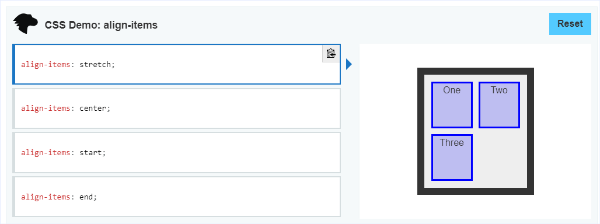

[https://developer.mozilla.org/en-US/docs/Web/CSS/align-items](https://developer.mozilla.org/en-US/docs/Web/CSS/align-items)

Проперти `align-items` задаёт значение для проперти `align-self` всех прямых детей как для Flexbox группы, что определяет выравнивание элементов вдоль [#поперечной-оси](https://developer.mozilla.org/en-US/docs/Glossary/Cross_Axis) (см. [cross-axis {flexbox}](https://www.notion.so/cross-axis-flexbox-ab914837aa24498287f68ae9c2e7bdca) ). В Grid Layout, это проперти контролирует выравнивание элементов вдоль Block Axis внутри своих [grid area](https://developer.mozilla.org/en-US/docs/Glossary/Grid_Areas).

-   {{ интерактивный пример }}
    
    
    

o o o

# Значения

o o o

## \= baseline, first baseline, lastbaseline

Все #флекс-элементы ([flex-element {flexbox}](https://www.notion.so/flex-element-flexbox-f0831f0f002b4ca3bba557dedeb053e8) ) выравниваются так что их [flex container baselines](https://drafts.csswg.org/css-flexbox-1/#flex-baselines) выравниваются. Элементы с наибольшим расстоянием между их cross-start-margin-edge и их baseline совмещаются с cross-start-edge линией (ОТ СЕБЯ: сомнения в переводе).

## \= stretch

Элементы растягиваются так что поперечный размер элемента становится таким же как у его родителя.

## \= safe \*